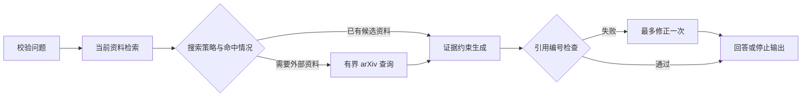

# 地震文献研究工作台

面向个人研究的本地文献 Agent：管理 PDF / TXT / MD，检索当前选中资料，按需补充 arXiv 摘要，生成带引用的回答，并保留可导出的来源与执行记录。

## 启动

需要 Python 3.10+。推荐独立环境，避免全局科学计算包与网页依赖冲突。

```powershell
python -m venv .venv
.\.venv\Scripts\python.exe -m pip install -r requirements.txt
Copy-Item .env.example .env
.\.venv\Scripts\python.exe -m streamlit run app.py
```

已有 `.env` 时保留现有文件。浏览器打开 <http://127.0.0.1:8501>，端口占用时追加 `--server.port 8502`。默认仅监听本机。

项目提供 `uv.lock`。已安装 uv 的环境可使用 `uv sync --locked --extra test`，随后运行 `uv run --extra test streamlit run app.py`，按锁定版本复现依赖。使用 uv 安装时，依赖检查命令为 `uv pip check`。

无 API Key 时可使用离线预览，完成检索和来源整理。已有 Key 时也可以主动勾选离线预览；此模式不会调用语言模型或远程 embedding，但 arXiv 仍受独立的搜索开关控制。

OpenAI 配置示例：

```env
MODEL_PROVIDER=openai
OPENAI_API_KEY=your_key
OPENAI_MODEL=gpt-4.1-mini
EMBEDDING_PROVIDER=local
```

DeepSeek 配置示例：

```env
MODEL_PROVIDER=deepseek
DEEPSEEK_API_KEY=your_key
DEEPSEEK_BASE_URL=https://api.deepseek.com
DEEPSEEK_MODEL=deepseek-chat
```

## 使用范围

- **文献问答**：独立研究问题、实时阶段进度、来源编号、原文片段、执行详情、Markdown 导出。
- **资料库**：批量上传、文件筛选、选择研究范围、确认删除。坏文件单独报告，不影响其他资料。
- **运行记录**：最近 50 条记录及 JSON 导出。可关闭持久记录；启用时会保存问题、回答摘要和来源文件名。
- **会话历史**：保留最近 20 次完整回答，切换控件与页签不丢失。浏览器断开后的新会话不会恢复完整回答；需要保存的研究结果请使用导出。

提问之间不自动继承历史问题或模型回答。追问时应在问题中明确研究对象，避免把上一轮未经核实的结论当作新证据。

上传限制：每个文件 20 MB，每批 60 MB；PDF 最多 500 页、提取文字最多 300 万字符，解析进程时限 25 秒。TXT / MD 使用 UTF-8。扫描 PDF 需要先 OCR；当前未集成 OCR。知识库每次最多处理 10000 个片段。

## Agent 的行为边界



- 文档、文件名和外部摘要以不可信数据传给模型，与系统约束分离。
- 单次任务最多一次 arXiv 搜索、两次模型生成调用；每次模型调用最多一次网络重试，连接有超时和输出长度限制。
- 没有来源时直接说明证据不足；工具失败和模型失败分别记录。
- 生成结果的引用编号必须属于提供的来源。修正后仍无有效引用时，不显示未通过检查的答案。
- **引用检查验证的是编号完整性，不证明逐句事实正确。** arXiv 提供的是摘要，无法据此核实论文全文中的实验细节。检索分数不是事实可信概率。
- 模型 Markdown 的原始 HTML、远程图片和任意外链不会成为可执行的网页内容；仅保留已知论文链接。

## 检索配置

`EMBEDDING_PROVIDER=local` 为离线关键词检索，包含英文停用词处理和中文双字片段匹配；它不是真正的跨语言语义模型。

`EMBEDDING_PROVIDER=openai` 使用 OpenAI embedding，产生相应 API 请求和费用。

本地语义模型可选安装：

```powershell
.\.venv\Scripts\python.exe -m pip install -e .[semantic]
```

```env
EMBEDDING_PROVIDER=sentence_transformers
LOCAL_EMBEDDING_MODEL=sentence-transformers/paraphrase-multilingual-MiniLM-L12-v2
```

首次使用本地语义模型可能下载权重。模型、索引或向量查询不可用时退回关键词检索，并在本次结果中报告实际检索方式。向量集合按资料内容和模型隔离，避免取消选择、修改文件后仍检索到旧内容。

## 数据与部署

`paper_library/` 保存上传原文件，`.chroma/` 保存派生索引，`logs/runs.jsonl` 保存可选运行摘要；这些目录及 `.env` 已排除出 Git。索引采用内容快照，旧快照仍可能保留派生文本；删除原文件不会自动擦除旧索引或历史导出。处理敏感资料时应同时管理这些本地副本。

启用模型服务会向所选供应商发送问题及候选片段。启用 OpenAI embedding 会发送待索引文本。启用 arXiv 会发送提取后的查询词。默认关闭 Streamlit 使用统计与 Chroma 匿名统计。

当前定位为**单用户、本机科研工作台**，没有多租户身份认证、用户级资料权限、分布式任务队列或高并发服务承诺。PDF 子进程是超时隔离，不是操作系统级恶意文件沙箱。需要公网共享时，应先完成身份认证、资料隔离和资源配额设计。

## 验证

```powershell
.\.venv\Scripts\python.exe -m pytest --basetemp output/pytest-venv
.\.venv\Scripts\python.exe eval_agent.py
.\.venv\Scripts\python.exe -m pip check
```

测试隔离实际模型密钥，包括真实 Chroma 持久化、本地 HTTP 模型协议、Streamlit 页面状态、上传并发、伪造引用、外链注入、PDF 失败与超时、日志损坏等场景。`eval_agent.py` 是确定性流程评测，不是模型准确率或科研结论正确率评测。

`output/pytest-venv` 是测试专用临时目录，pytest 会在下次运行时清空它；不要在其中放置研究资料。指定该目录也能避开 Windows 系统临时目录的历史权限冲突。

真实 PDF 的提取检查：

```powershell
.\.venv\Scripts\python.exe validate_pdf_ingestion.py "paper.pdf"
```

本次第一性原理审查、反例与剩余限制见 [审查记录](docs/REVIEW.md)。
