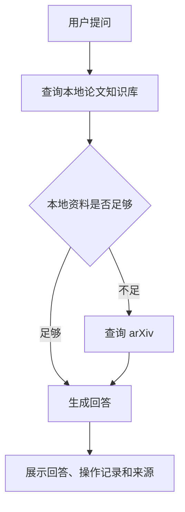

# 地震/地球物理文献问答 Agent

这是一个正在完善的 Agent 网页项目。它可以读取地震和地球物理相关论文，回答用户问题，展示答案来源，并在本地资料不足时尝试查询 arXiv。

## 项目亮点

- 支持上传 PDF、TXT、MD 资料
- 支持本地论文资料库：上传后持久保存，可选择参与本次问答，也可删除
- 支持内置示例资料，打开后可以直接试用
- 支持 OpenAI API，也保留 DeepSeek API 选项
- 使用本地知识库回答问题，并展示参考来源
- 支持可配置 embedding 检索，并融合关键词匹配做简单重排
- 通过 Agent 流程判断是否需要查询外部论文
- 支持手动打开 arXiv 查询，方便演示外部工具调用
- 没有可靠资料时会说明资料不足，避免乱答
- 带运行观察面板，展示耗时、本地命中、arXiv 返回、来源数量和最近运行记录
- 内置评测脚本，自动检查本地检索、外部搜索和拒答行为
- 没有 API Key 时也能进入网页查看完整流程

## 技术栈

- Python
- Streamlit
- LangChain
- LangGraph
- Chroma
- OpenAI / DeepSeek
- arXiv

## 快速开始

```powershell
python -m venv .venv
.\.venv\Scripts\Activate.ps1
pip install -r requirements.txt
Copy-Item .env.example .env
```

如果你想用 OpenAI，把 `.env` 改成：

```env
MODEL_PROVIDER=openai
OPENAI_API_KEY=你的 OpenAI API Key
OPENAI_MODEL=gpt-4.1-mini
EMBEDDING_PROVIDER=local
```

然后启动网页：

```powershell
streamlit run app.py
```

打开：

```text
http://localhost:8501
```

## 论文管理

网页左侧支持把 PDF、TXT、MD 保存到本地资料库。默认目录是：

```env
PAPER_LIBRARY_DIR=paper_library
```

保存后的论文不会提交到 GitHub。你可以在页面里选择哪些论文参与本次问答，也可以在“论文管理”页签删除不需要的文件。

## 运行观察

每次提问后，页面会显示本次运行的关键信息：

- 总耗时
- 本地论文命中数量
- 本地最高相关度
- arXiv 返回数量
- 最终引用来源数量
- 是否触发 arXiv、是否拒答、模型是否异常

运行摘要会写入本地日志：

```env
LOG_DIR=logs
```

日志文件是 `logs/runs.jsonl`，用于复盘最近几次问答表现。

## 使用 DeepSeek

如果想切回 DeepSeek，把 `.env` 改成：

```env
MODEL_PROVIDER=deepseek
DEEPSEEK_API_KEY=你的 DeepSeek API Key
DEEPSEEK_BASE_URL=https://api.deepseek.com
DEEPSEEK_MODEL=deepseek-chat
```

## 检索模式

默认配置使用本地混合检索，不需要额外 API 费用：

```env
EMBEDDING_PROVIDER=local
```

如果你有可用的 OpenAI API 额度，可以启用真实语义向量检索：

```env
EMBEDDING_PROVIDER=openai
OPENAI_EMBEDDING_MODEL=text-embedding-3-small
```

系统会把向量检索结果和关键词匹配结果融合排序，减少只靠单一路径漏掉相关论文片段的情况。如果 embedding 服务不可用，系统会自动退回本地关键词检索，网页不会直接崩溃。

## 项目流程



## 示例问题

- 地震预警系统为什么需要快速估计震级和震源位置？
- 地震风险由哪些因素组成？
- 地球物理反演为什么通常是不适定问题？
- 机器学习在地震研究里能帮什么忙？
- 如果本地论文没有覆盖密集台阵监测，系统会怎么处理？
- 演示 arXiv：把侧栏“外部搜索”改成“总是查询 arXiv”，再提问“密集地震台阵如何提升小震检测？”
- 演示拒答：关闭 arXiv 后提问“明天上午北京会不会发生 7 级地震？”

## 测试

```powershell
pytest
```

## Agent 评测

项目内置了一个轻量评测 harness，用固定问题检查 Agent 的关键行为是否稳定：

```powershell
python eval_agent.py
```

它会检查三类场景：

- 本地论文能够回答的问题
- 需要展示 arXiv 外部搜索的问题
- 没有可靠来源时触发拒答的问题

## 简历表述

基于 LangChain + LangGraph 构建地震/地球物理文献问答 Agent，集成本地论文 RAG 检索与 arXiv 外部搜索工具，支持答案来源追踪和资料不足时的拒答机制；优化检索链路，支持可配置 embedding 检索、关键词融合排序和失败兜底；使用 Streamlit 提供可交互网页 Demo，并构建轻量评测 harness 自动验证本地检索、外部工具调用和拒答行为。

增强版表述：

基于 LangChain + LangGraph 构建地震/地球物理文献问答 Agent，支持本地论文资料库管理、RAG 检索、arXiv 外部搜索、答案来源追踪和资料不足拒答；设计运行观察面板记录每次问答的耗时、命中数量、外部工具调用和来源覆盖情况，并通过 Streamlit 提供可交互网页 Demo。
